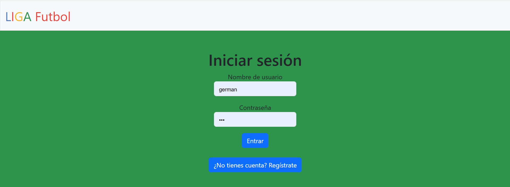
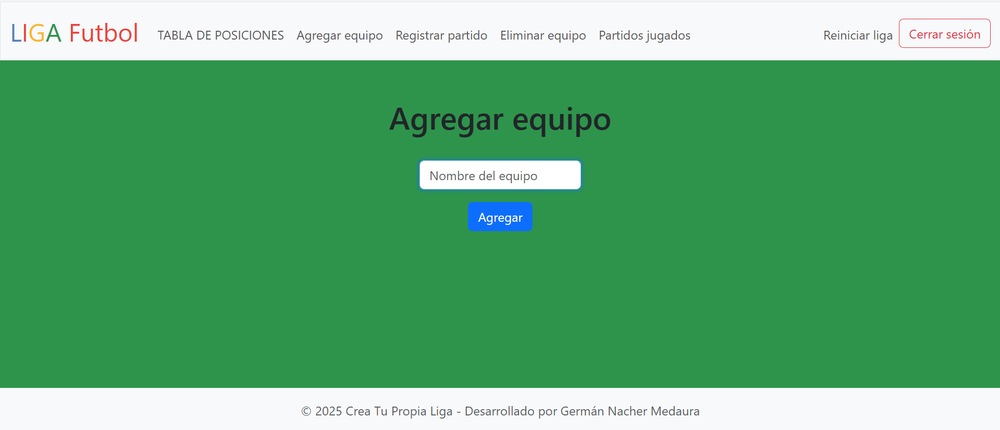
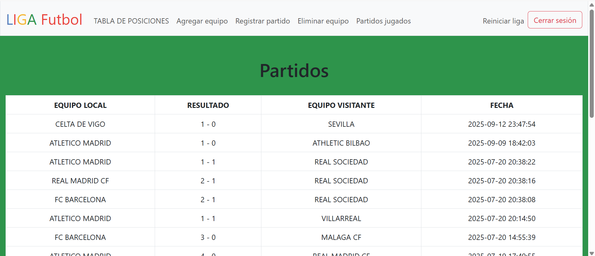
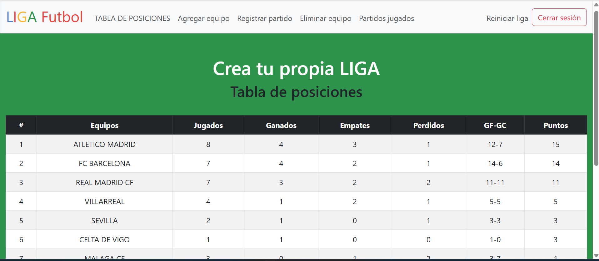
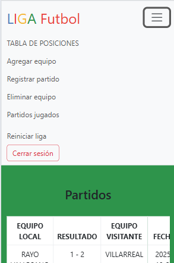

# 🏆 Gestor de Ligas de Fútbol

Aplicación web desarrollada para permitir a personas o ligas de barrio gestionar torneos de fútbol de forma simple, centralizada y accesible desde cualquier dispositivo.

El sistema permite crear ligas, equipos y partidos, registrar resultados y visualizar tablas de posiciones, evitando el uso de planillas manuales o soluciones improvisadas.

---

## 🚀 Funcionalidades principales

- Registro e inicio de sesión de usuarios
- Creación y gestión de ligas de fútbol
- Alta y eliminación de equipos
- Registro de partidos y resultados
- Cálculo automático de puntos y posiciones
- Visualización de tablas y estadísticas
- Acceso a la información según el usuario autenticado
- Medidas básicas de seguridad contra accesos no autorizados e inyecciones SQL

---

## 🛠 Tecnologías utilizadas

- **Backend:** PHP  
- **Base de datos:** MySQL  
- **Servidor:** Apache (XAMPP)  
- **Frontend:** HTML, CSS, JavaScript, Bootstrap  
- **Editor:** Visual Studio Code  

---

## ⚙️ Instalación y ejecución

1. Clonar el repositorio
2. Copiar el proyecto dentro de la carpeta `htdocs` de XAMPP
3. Importar la base de datos MySQL
4. Iniciar Apache y MySQL desde XAMPP
5. Acceder desde el navegador a `http://localhost/futbol-creador-ligas`

---

## 🖼 Capturas de la aplicación
> 

### ⚽ Menú de bienvenida

### 🔐 Inicio de sesión

### 👥 Agregar equipo

### 🏟 Registrar partido

### 📅 Registro de partidos

### 📊 Tabla de posiciones

### 📱 Diseño adaptable a móviles

---

## 🎯 Objetivo del proyecto

Facilitar la gestión de ligas locales de fútbol mediante una plataforma web intuitiva, permitiendo a cualquier usuario llevar el control de sus torneos sin necesidad de conocimientos técnicos.

---

## 👨‍💻 Autor

Desarrollado como proyecto final académico y portfolio personal.
